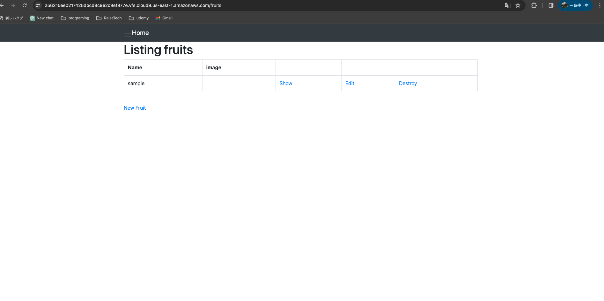
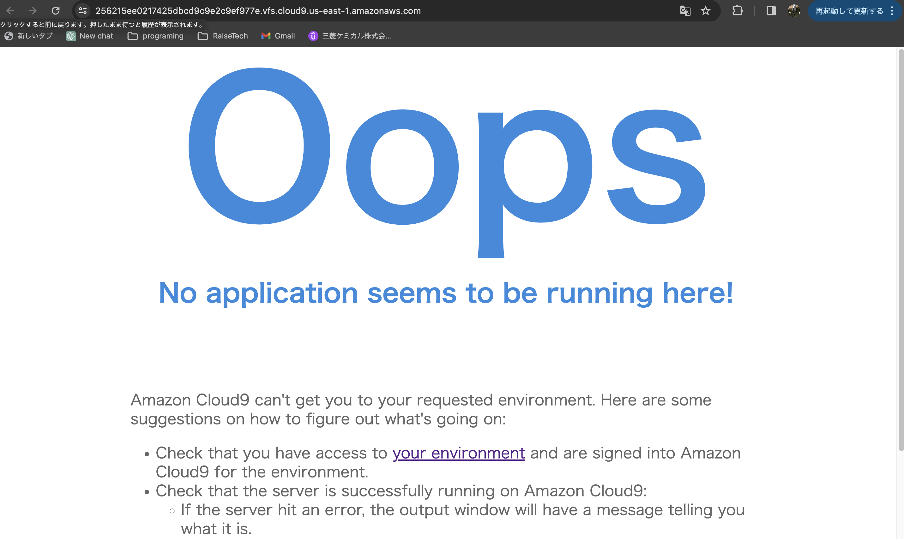
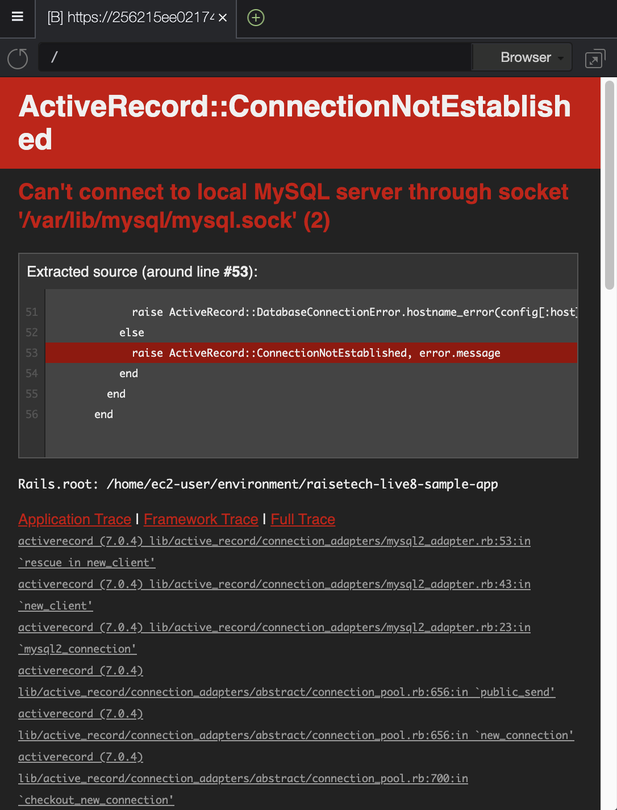

# 第３回講義の課題

## 課題内容

1. サンプルアプリケーションのデプロイ
1. AP サーバーについて
1. DB サーバーについて
1. Rails構成管理ツール
1. 学んだこと

## 1.　サンプルアプリケーションのデプロイ

1 git clone でサンプルアプリのリポジトリをローカルにクローンする

2 それぞれの動作環境のバージョンを確認してインストールする
ここでは、ruby、node、yarnが必要
⇨　Rubyの場合、rvm install バージョンを実行する。
インストールが完了したら、rvm use バージョンを実行する。
最後に　ruby -vを実行してバージョンを確認する

3 database.ymlをコピーする

4 database.ymlの中にMySQLのバスワードと、socketファイルのファイルパスを入力する。socketのファイルパスの確認は、cat /etc/my.cnfで確認

 ※以下cat /etc/my.cnfの説明

     LinuxやUnix系のシステムでMySQLデータベースサーバーの設定ファイルを表示するためのコマンドです。catはファイルの中身を標準出力に表示するためのコマンドで、/etc/my.cnfはMySQLの設定ファイルが通常配置される場所です。
    具体的には、このコマンドを実行すると、my.cnfファイルの内容がターミナルに表示されます。my.cnfファイルはMySQLの設定を調整するためのテキストファイルで、データベースエンジンや接続設定、キャッシュのサイズ、ログの設定など、さまざまなMySQLの動作に関する設定情報が記述されています。
    なお、/etc/my.cnfが存在しない場合、MySQLはデフォルトの設定値を使用します。設定を変更する際は、このファイルを編集するか、他の設定ファイルを使用する場合もあります。

5 環境構築するためにbin/setupを実行する

     ※以下bin/setupの説明
     bin/setupは、Railsプロジェクトや他の一部の開発環境で使用されるスクリプトです。通常、これはRailsアプリケーションの初回のセットアップを行うために使用されます。

６ cloud９上でアプリケーションを起動するために、bin/cloud9_devを実行
     ※blocked hostとエラーで出てしまった場合、一旦control+cでアプリケーションを停止して、そこに記載しているurlをdevelopment.rdの最後の行に貼り付けて再度実行すると、エラーが解消される。

## 2.　 AP サーバーについて

1.APサーバーとは

    APサーバー（Application Server）は、ウェブアプリケーションやモバイルアプリケーションなど、アプリケーションを実行するためのサーバーソフトウェアです。APサーバーは、クライアントからのリクエストを受け取り、それに対する処理を行い、最終的にクライアントにレスポンスを返す役割を果たします。（chatgptより）

2.APサーバーの名前とバージョン

    名前：Puma
    バージョン：5.6.5

3.APサーバを終了させた場合、引き続きアクセスできるか？

    サーバーを停止すると以下のように表示される。再度起動すると解消される

## 3.　 DB サーバーについて

1 DBサーバーとは

     DBサーバー（データベースサーバー）は、データベースを管理し、データベースへのアクセスを提供するコンピューターシステムまたはソフトウェアのことを指します。データベースは、組織が情報を効果的に管理し、検索するための仕組みであり、データベースサーバーはそのデータベースを効率的に運用する役割を果たします。（chatgptより）

2 DBサーバーの名前とバージョン

     名前：MYSQL
     バージョン：3.0.35
     確認方法：mysql -u root -p

3 DBサーバを終了させた場合、引き続きアクセスできるか？

     停止:sudo service mysqld stop
     再開:sudo service mysqld start
     停止すると以下のようなエラーが表示され、再開するとエラーは解消される。

## 3.　 構成管理ツールについて

     bundler
     RubyのプロジェクトにおいてGemの依存関係を管理するためのツールです。Rubyのプロジェクトは通常、さまざまなGemに依存しており、これらのGemのバージョン管理や依存関係の解決はプロジェクトの正常な動作に重要です。Bundlerはこのような問題を解決するために使われます。

## 4.　 感想

     webアプリケーションの仕組み、開発の流れ、デプロイ方法などの基本的なことを学びました。そのほとんどが聞きなれない言葉なので、しっかりと復習をして知識を深めたいと感じました。またデプロイ方法に関しては、現状自分一人でできる自信がないので、もう少し、コマンドやコードの理解に努めたいと感じました。

 　　　    

