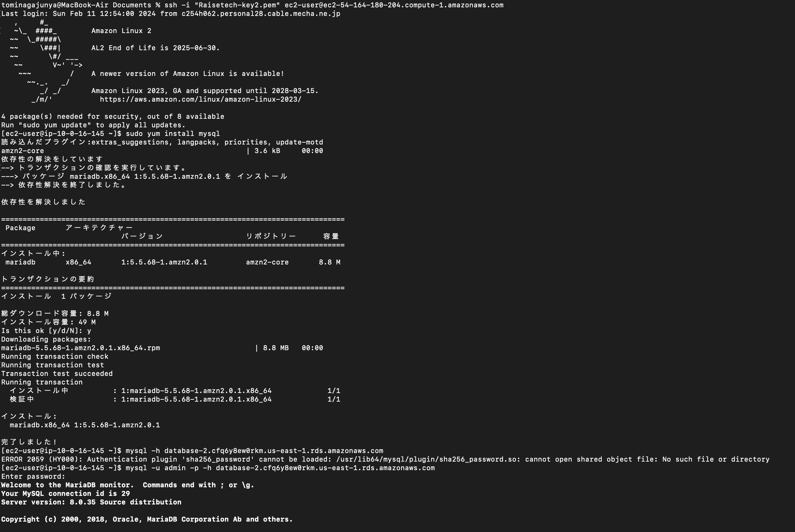

# 第 4 回講義の課題

## 課題内容

1. VPCの作成
1. EC2の構築
1. RDSの構築
1. EC2からRDSへ接続
1. 学んだこと・苦労したこと

## 1.　VPCの作成

.png)

## 2.　EC2の構築

.png)

.png)

.png)

.png)

## 3.　RDSの構築

.png)

## 4.　EC2からRDSへ接続

## 4.　学んだこと・苦労したこと

EC2やRDSのセキュリティーグループの作成に特に苦労しました。その設定を間違えていたために、EC2のSSH接続ができずかなり時間がかかってしまいました。
また、インスタンスのマシンイメージをAmazon Linux 2023に設定していたために、Mysqlがインストールできなかったりと、一つの設定が間違っているだけでエラーが発生してしまうことを実感しました。（このエラーはマシンイメージをAmazon Linux 2に変更することで解消できました。）ただ、エラー一つ一つを自分の力で調べながら解消できたことは今後に繋がるように感じました。

